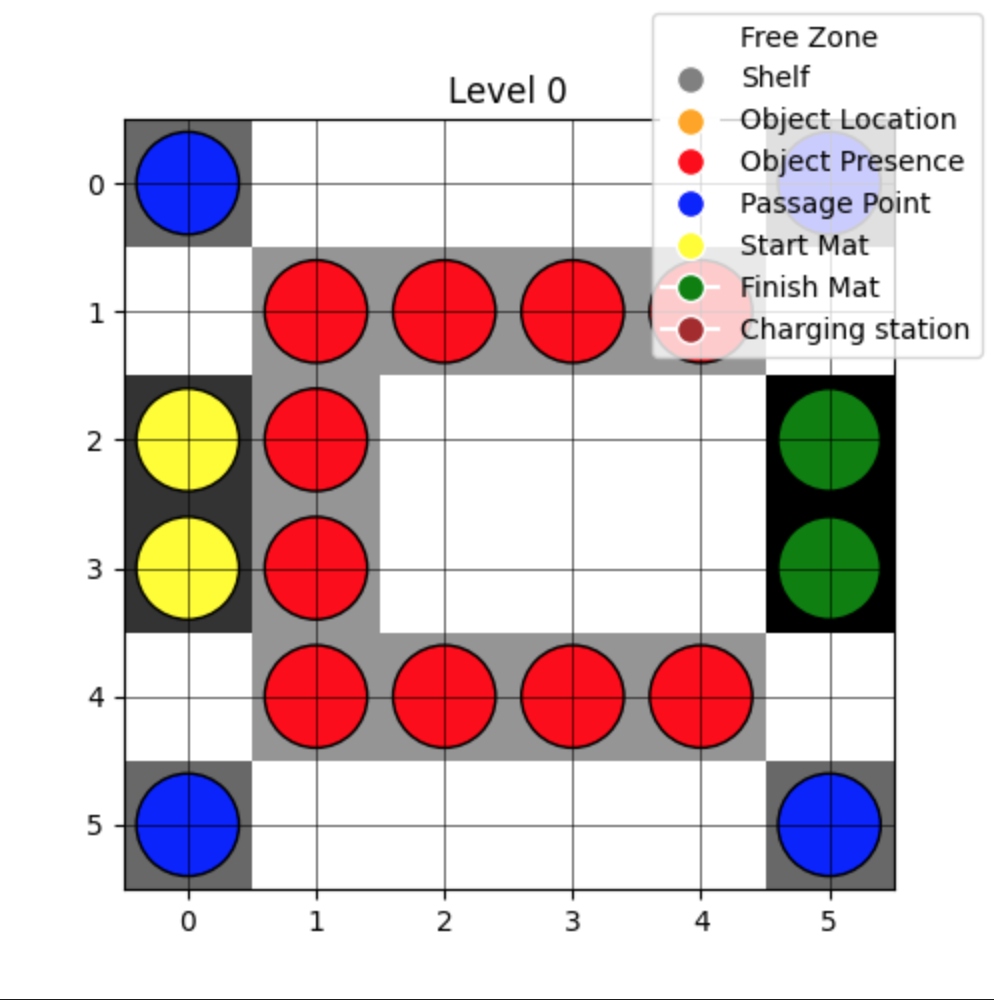

# Drone Planification Project


## warehouse.py

`warehouse.py` is one of the most important scripts in the project since it is used to design a tailor-made warehouse. This file contains several classes:

### Classes

1. **WarehouseError**
   - A custom exception class used to handle errors specific to the warehouse operations, such as invalid coordinates or obstacles.

2. **Warehouse3D**
   - The main class that represents a 3D warehouse. It includes methods to manage the warehouse layout, add shelves, storage lines, objects, and more. Key functionalities include:
     - **Initialization**: Creates a 3D matrix to represent the warehouse layout.
     - **Adding Shelves**: Allows the addition of shelves at specified levels and coordinates.
     - **Adding Storage Lines**: Marks storage lines on shelves for object placement.
     - **Adding Objects**: Places objects on shelves or designated storage locations.
     - **Adding Checkpoints**: Defines checkpoints for navigation and connects them in a graph.
     - **Pathfinding**: Uses BFS (Breadth-First Search) to compute the shortest path between two points in the warehouse.
     - **Visualization**: Provides methods to display the warehouse layout and checkpoint graph.

3. **Object**
   - Represents an object in the warehouse. It includes attributes like `id`, `is_on_shelf`, and coordinates (`row`, `col`, `height`). It also provides a method to move the object to a new location.

### Key Features

- **3D Warehouse Representation**: The warehouse is represented as a 3D matrix, allowing for multi-level storage and navigation.
- **Customizable Layout**: Users can add shelves, storage lines, objects, and checkpoints to design a warehouse tailored to their needs.
- **Pathfinding**: The BFS algorithm is used to compute the shortest path between two points, ensuring efficient navigation.
- **Visualization**: The warehouse layout and checkpoint graph can be visualized using `matplotlib` and `networkx`.

### Usage

To use the `warehouse.py` script, follow these steps:

1. **Initialize the Warehouse**:
   ```python
   warehouse = Warehouse3D(name="MyWarehouse", rows=10, cols=10, height=3, mat_capacity=100)


## adjacency_matrix.py

Tha adjacency matrix is generated from the warehouse matrix. The value at position (i, j) of the warehouse matrix correspond to the category of the case (i, j) in the warehouse, as defined in the dictionnary category_mapping.

The script `adjacency_matrix.py` goes through the warehouse matrix first on the z axis, then x axis, then y axis.

Adjacency matrix contains the Manhattan distances for these categories in order : 
- empty storage line (category 2)
- full storage line (category 3)
- checkpoint (catégorie 4)
- start mat (category 5)
- finish mat (category 6)
- charging station (category 7)

The script only calculates distances between checkpoint that are connected and relevant categories.

This way, it calculates the distance : 
- checkpoint and all its connected checkpoints
- checkpoints and storage line
- checkpoints and objects
- start mat and finish mat
- start mat and checkpoint
- finish mat and checkpoint
- (charging stations ?)

The script generates the adjacency matrix by block for these distances above only and assemble everything in a global matrix.




## Name
Optimizing drone trajectory in restricted environments

## Description
This project focuses on generating optimized 4D drone trajectories in a warehouse to minimize total flight time while avoiding collisions considering a safety distance between drones. The goal is to provide to the warehouse workforce a full optimized planification for the day by implementing heuristics to help buil trajectory strategy.

## Installation and Prerequisites

### Clone the repository

   ```python
   git clone https://gitlab.ec-lyon.fr/belote/drone-planification-project.git`
```

### Install dependencies
   ```python
   pip install -r requirements.txt
```

### Project Structure

The `drone-planification-project` folder is divided into 5.
- **Data_test** : sample data and images.
- **Evitement** : 
   - `avoidance.py` detects and fixes the collision and near misses in the drone planning. The cost function for the optimisation is being generated.
   - `optimisation.py` computes the simulated annealing algorithm to optimize flight time using the metropolis acceptance criteria.
- **Planification** :
   - 4 Python files :
      - `adjacency_matrix.py` computes the adjacency matrix considering our warehouse modelisation and checkpoints connections.
      - `bellman.py` contains the Bellman algorithm to find the shortest path for each trajectory using the adjacency_matrix generated by the previous Python file.
      - `planification.py` 
      - `task_list_generator.py` for testing purpose, generates a random task list (containing the task_type, the id of the object involved, initial position of the drone, final position of the drone, start time of the task).
- **Warehouse** : 
   - `warehouse_builder.py` to create warehouse with the Warehouse3D class and the configuration file containing warehouses parameters.
   - `warehouse.py` contains the class Warehouse 3D
   - `config_warehouse.json` to register the parameters for each warehouse we are using to test our algorithms.

- **Visualisation** : 
   - `animation.py` computes the 3D dynamic trajectories of the drones in the warehouse using the      library plotly.
   - `drone_animation.html` is the HTML output of the `animation.py` file


### How to use
The main.py Python file contains the entire pipeline for the project. The user can modify the parameters according to his needs : 
- *warehouse_name* : to select the warehouse to work on the configurations JSON file
- *n_objects* : the number of objects that needs to be treated in the warehouse for this day
- *arrival_time_slots* : defines the time slots when objects are arriving on the starting mats
- *arrival_time_slots* : defines the time slots when objects are leaving to the final mats

*NB : seed enables reproductibility of the results and should not be modified by the user.*

## Expected output

## Project status
Work in progress.
